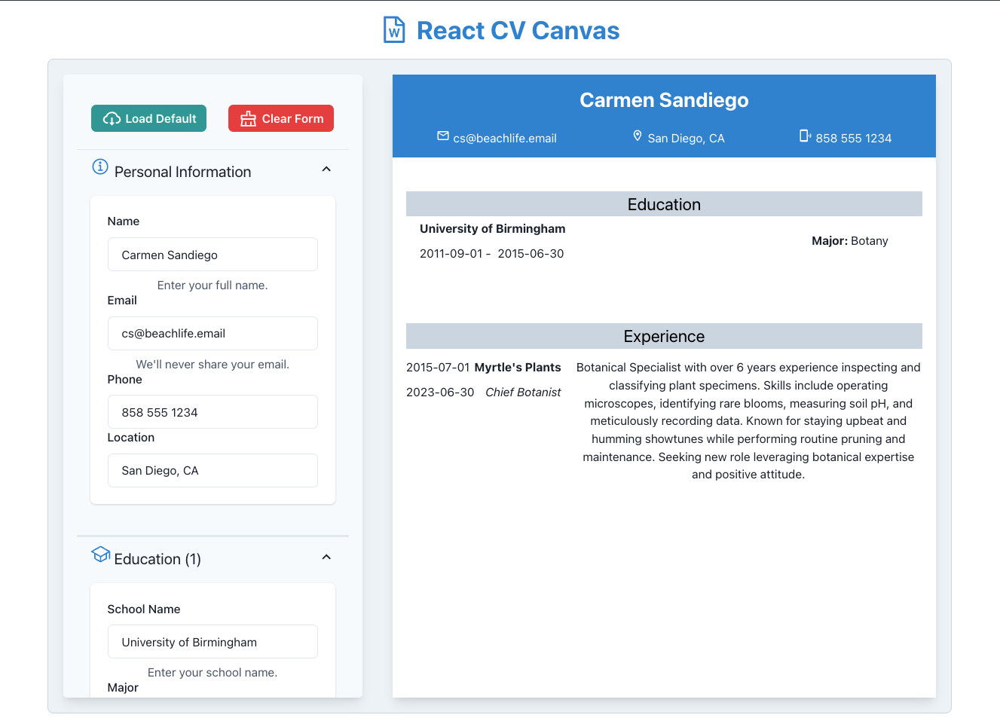

# CV Builder App in React 

Welcome to the CV Builder App. Built using the latest version of React. This app aims to provide users with an intuitive interface to design their perfect CV.

[Live app](https://react-cv-canvas.netlify.app/)

## Getting Started:

1. Clone the repo.
2. Run npm install or yarn install (whichever you fancy).
3. Fire up with npm start or yarn start.

## Anticipated Additions:

- Swap CV themes on the fly.
- Guided tooltips for that extra hand.
- Multiple export formats. Not just PDFs!

Want a feature? Found a bug? Feel free to shoot a PR or raise an issue.
